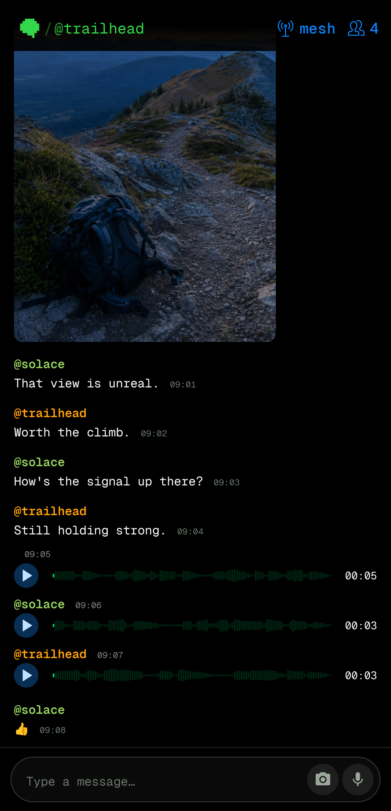
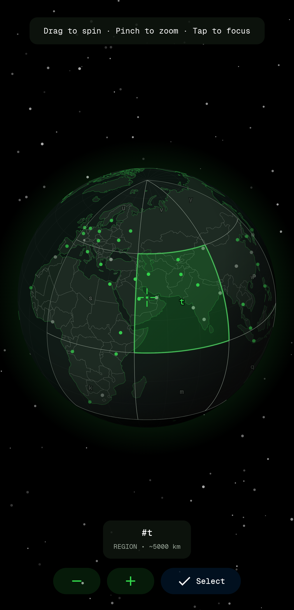

## bitchat for Android

A decentralized peer-to-peer messaging app with dual transport architecture: local Bluetooth mesh networks for offline communication and internet-based Nostr protocol for global reach. No accounts, no phone numbers, no central servers.

This is the Android implementation of bitchat, fully protocol-compatible with the [iOS version](https://github.com/permissionlesstech/bitchat) for cross-platform mesh communication.

[bitchat.free](http://bitchat.free)

[GitHub Releases](https://github.com/permissionlesstech/bitchat-android/releases)

[](https://play.google.com/store/apps/details?id=com.bitchat.droid)

## See it in action

<table>
  <tr>
    <th>Offline mesh conversation</th>
    <th>Geohash globe picker</th>
  </tr>
  <tr>
    <td></td>
    <td></td>
  </tr>
</table>

## License

This project is released into the public domain. See the [LICENSE](LICENSE.md) file for details.

## Features

- **Dual Transport Architecture**: Bluetooth LE mesh for offline messaging, Nostr relays for internet-based messaging
- **Location-Based Channels**: Geographic chat rooms using geohash coordinates over Nostr relays
- **Intelligent Message Routing**: Automatically chooses the best transport, with queuing and retry when a peer is unreachable
- **End-to-End Encryption**: [Noise Protocol](https://noiseprotocol.org) (XX pattern, X25519 + ChaCha20-Poly1305) for private messages over the mesh
- **Decentralized Mesh Network**: Automatic peer discovery and multi-hop relay over Bluetooth LE (max 7 hops)
- **Wi-Fi Aware Transport**: Higher-bandwidth local mesh on supported devices
- **Channel Chats**: Topic-based group messaging with optional password protection (Argon2id + AES-256-GCM)
- **IRC-Style Commands**: Familiar `/join`, `/msg`, `/who` style interface
- **Tor Support**: Built-in Tor (Arti) for private internet connectivity
- **Emergency Wipe**: Triple-tap to instantly clear all data
- **Cross-Platform**: Binary protocol compatible with bitchat on iOS and macOS
- **VLM Integration**: Built-in HTTP API for vision-language models to send images and dense captions

## Technical Architecture

### Bluetooth Mesh Network (Offline)

- Direct peer-to-peer within Bluetooth range, multi-hop relay through nearby devices
- Noise Protocol sessions with forward secrecy; peer identities derived from static keys
- Compact binary packet format with fragmentation, TTL routing, and deduplication
- Adaptive duty cycling and connection limits for battery efficiency
- Foreground service keeps the mesh alive within Android background execution limits

### Nostr Protocol (Internet)

- Global reach via public relays, geohash-based location channels
- Private messages fall back to Nostr for mutual favorites when the mesh is unavailable
- Ephemeral keys per geohash area

### Android Stack

- Kotlin, Jetpack Compose (Material 3), MVVM
- Coroutines and Flow for all networking and state
- Core components: `MeshForegroundService` (persistent connectivity), `BluetoothMeshService` / `WifiAwareMeshService` (transports), `UnifiedMeshService` (transport selection), `NoiseSessionManager` (encryption sessions), `MessageRouter` (mesh/Nostr routing with outbox retry)

## Building

Requires Android Studio and the Android SDK (API 26+).

```bash
git clone https://github.com/permissionlesstech/bitchat-android.git
cd bitchat-android
./gradlew assembleDebug
```

Install on a connected device:

```bash
adb install -r app/build/outputs/apk/debug/app-debug.apk
```

The app requests Bluetooth, location (required for BLE scanning), and notification permissions at runtime.

Release APKs and the Android App Bundle can be rebuilt byte-for-byte in the
pinned Linux container. Maintainers should follow the
[Android release guide](docs/maintainer-release-guide.md). See
[Reproducible builds](docs/reproducible-builds.md) for the build trust model
and public GitHub/Google Play verification procedures.

## Testing

```bash
# Unit tests
./gradlew test

# Lint
./gradlew lint

# Instrumented tests (requires a device or emulator)
./gradlew connectedAndroidTest
```

Note that BLE mesh behavior is difficult to emulate; protocol and session logic is covered by unit tests, while radio-level behavior needs real devices.

## VLM Integration API

Bitchat exposes a built-in HTTP API for vision-language model (VLM) integration, allowing external applications to send images and dense captions through the Bitchat mesh network.

### Quick Start

1. **Enable VLM API**: Settings → VLM API Settings → Enable
2. **Connect**: Use WiFi IP or `adb forward tcp:8765 tcp:8765`
3. **Send Messages**: HTTP POST to `http://127.0.0.1:8765`

### Example: Send Image + Dense Caption

```python
import requests

# Send image with VLM-generated description
with open("screenshot.jpg", "rb") as f:
    response = requests.post(
        "http://127.0.0.1:8765/send/analysis",
        files={"image": f},
        data={"description": "VLM detected: Person at desk, laptop open"}
    )
    print(response.json())
```

### Endpoints

| Endpoint | Description |
|----------|-------------|
| `POST /send/text` | Send text message |
| `POST /send/image` | Send image with optional caption |
| `POST /send/analysis` | Send image + VLM description |
| `GET /status` | Check API and mesh status |

**Full Documentation**: See [VLM API Documentation](docs/VLM_API.md) for complete integration guide, Python/JavaScript clients, and advanced usage examples.
